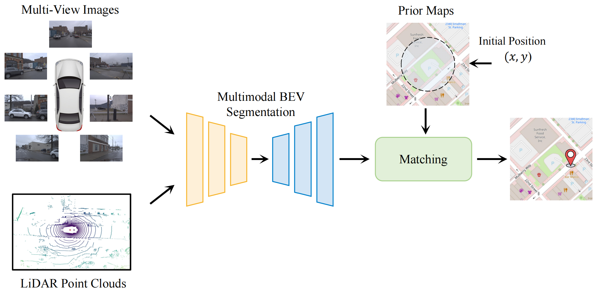

# SegLocNet
This is the official implementation for our paper: [[arXiv]](https://arxiv.org/pdf/2502.20077)

**SegLocNet: Multimodal Localization Network for Autonomous Driving via Bird’s-Eye-View Segmentation**

[Zijie Zhou](https://github.com/ZhouZijie77), [Zhangshuo Qi](https://github.com/QiZS-BIT), [Luqi Cheng](https://github.com/ChengLuqi), Guangming Xiong*

> The code will be released as soon as our paper is accepted.



To address the localization challenges due to signal occlusion and multipath errors in urban environments, we propose SegLocNet, a novel multimodal localization network that leverages multi-view images and the LiDAR point cloud to construct the local BEV semantic map of the surroundings. The precise pose estimation is achieved through the alignment of the BEV semantic map with the lightweight prior map.

## Installation
This repository is built upon [mmdetection3d](https://github.com/open-mmlab/mmdetection3d). Users can refer to [the official link](https://mmdetection3d.readthedocs.io/en/latest/get_started.html) for installation. We also provide a [step-by-step installation instruction](docs/install.md).
* Environments:  
  Pytorch==2.1.2, CUDA==11.8, mmcv==2.1.0, mmdet==3.3.0, mmdet3d==1.4.0

## Data Preparation
We use nuScenes and Argoverse Tracking dataset for training and evaluation.
Follow [data_preparation.md](docs/data_preparation.md) to download and prepare data.

## Train
```bash
cd SegLocNet
```
Train with a single GPU
```bash
# nuScenes HD maps
python tools/train.py projects/SegLocNet/configs/seglocnet_nusc_hd.py

# nuScenes SD maps
python tools/train.py projects/SegLocNet/configs/seglocnet_nusc_sd.py
```
Train with multiple GPUs
```bash
# nuScenes HD maps
./tools/dist_train.sh projects/SegLocNet/configs/seglocnet_nusc_hd.py ${GPU_NUM}

# nuScenes SD maps
./tools/dist_train.sh projects/SegLocNet/configs/seglocnet_nusc_sd.py ${GPU_NUM}
```

## Test
```bash
cd SegLocNet
```
Test with a single GPU
```bash
# nuScenes HD maps
python projects/SegLocNet/configs/seglocnet_nusc_hd.py ${CHECKPOINT_FILE}

## nuScenes SD maps
python projects/SegLocNet/configs/seglocnet_nusc_sd.py ${CHECKPOINT_FILE}
```
Test with multiple GPUs
```bash
# nuScenes HD maps
./tools/dist_test.sh projects/SegLocNet/configs/seglocnet_nusc_hd.py ${CHECKPOINT_FILE} ${GPU_NUM}

## nuScenes SD maps
./tools/dist_test.sh projects/SegLocNet/configs/seglocnet_nusc_sd.py ${CHECKPOINT_FILE} ${GPU_NUM}
```

## TODO

- [X] Release the [paper](https://arxiv.org/pdf/2502.20077)
- [ ] Release the source code for SegLocNet
- [ ] Release the info files and the osm files

## Citation
If you find this project useful for your research, please consider citing:
```bibtex
@article{zhou2025seglocnet,
  title={SegLocNet: Multimodal Localization Network for Autonomous Driving via Bird's-Eye-View Segmentation},
  author={Zhou, Zijie and Qi, Zhangshuo and Cheng, Luqi and Xiong, Guangming},
  journal={arXiv preprint arXiv:2502.20077},
  year={2025}
}
```

## Acknowledgement
Many thanks to these excellant open source projects:
- [PETR](https://github.com/megvii-research/PETR)
- [OrienterNet](https://github.com/facebookresearch/OrienterNet)
- [mmdetection3d](https://github.com/open-mmlab/mmdetection3d)